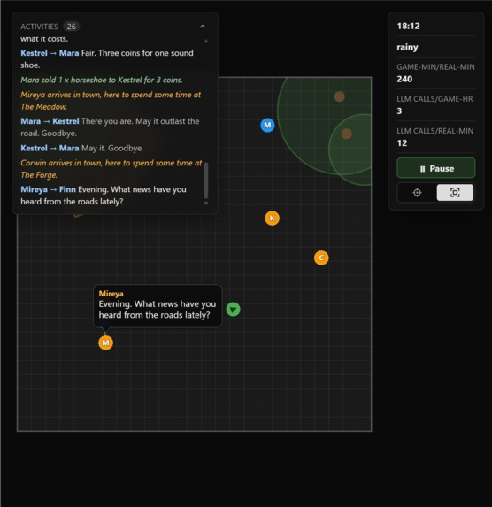
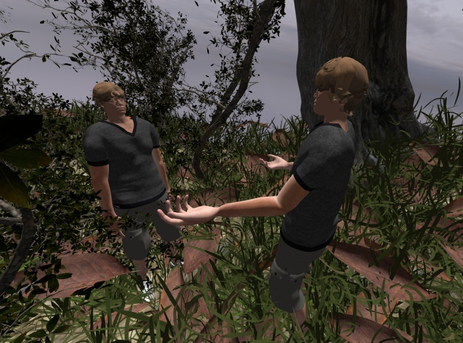
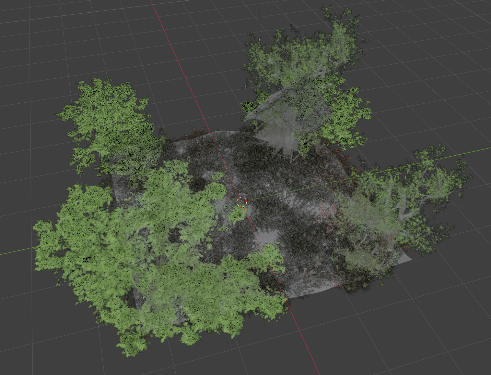

## Build Instructions
Download the resources from the [latest release](https://github.com/AdrianYip1/living-npc/releases/latest) and extract into the repo root.

## Living NPCs

  
   
  <b><a href="https://www.youtube.com/watch?v=ekAkxhsfbZo">Watch the demo on YouTube</a></b>

In most games, a key pillar of immersion and realism comes from the NPCs: non-player characters. How they act, what they say are all tools that a developer can use. However, there are only so many dialogue options, side quests, and reactions you can hard-code in. Inevitably, there are situations that it can't account for: the NPC fails to act or react in a appropriate manner, and the illusion for the player breaks.

For NPCs to feel **real**, they need to be able to handle all types of situations: be adaptable, have their own personalities, and their own memory too. There are two parts to this project that when combined, improves believability: Game Agents will make sure the NPCs talk and act real, and 3D Rendering and Facial Animations will make sure they look and feel real. 

## Part I - Game Agents

  

An NPC that remembers your last conversation and acts on its own changes the feel of a game more than any amount of hand written dialogue. Effectively, we have created an sandbox game environment, where every NPC has is represented by an AI agent that has the ability to perceive, speak, and act.

We built a custom agent hardness that takes in queries alongside with NPC personality, recent actions, memory, among other environmental variables, and generate an output: either dialogue or action. It interacts directly with simulated game environment: and that information is communicated to the 3D models, which we will touch on later.

The biggest challenge we had, which is a fairly common one for projects that relies on LLMs, is consistency and reliability. Robust harness and orchestration often requires repeated verifications, complicated prompts and diverse sets of tools, but with that comes with latency. In a video game, the few seconds of inference time makes a huge difference, so finding that balance between speed and reliability is very necessary, and something we need to improve upon.

## Part II - 3D Rendering and Animations

  

Game developers can't code every dialogue and action, and actors can't record every single possible line either. Therefore, we came up with a plan to deliver consistent and realistic facial animations, gestures, and voices to 3D models to accompany their backend logic.

The face and lips of the NPCs are procedurally animated and lip synced to the resulting output audio provided by Azure AI. We took inspiration from JALI and S3, graphics programming research groups and papers, to derive a way to animate the lips and faces of the NPC models procedurally using visemes, which Azure AI provided us with. JALI makes use of many rules and observations of viseme IDs, classifications on mouth shapes when speaking, such as lips being required to touch during a bilabial for realistic animations. Additionally, S3 describes how the eyes move and cascade during speech, where we created a state machine consisting of a "GAZE" and "FOCUS" state, each with differing probabilities of cascading, averting, and blinking eyes.

These animations are run and visualized via a custom Vulkan API rendering engine, which uses the standard rendering pipeline on top of a custom glTF model loader. Using the model loader, we created a 3D scene using blender to be copied into Vulkan buffer objects. This engine gives the abilities for movement using a camera class, where we handled ground collisions with the Möller-Trumbore intersection algorithm. Additional graphics techniques were added to increase the realism of the rendered scenes, most notably a day/night skybox cycle, diffuse lighting, and shadow mapping.

## Part III - Connecting The Game Agents in 3D

  

The logic and ground truths of the 3D engine rely on the sandbox game environment mentioned in Part I. As NPCs are agentic in nature, their movements and actions are driven in this sandbox and reflected onto the Vulkan renderer. Talking to an NPC in the 3D world will drive a response from the sandbox, where Azure AI will then output the audio of this response and pass it to our procedural animation calculations in 3D.

## Built with

- **[enginemath](https://github.com/AdrianYip1/enginemath.git)**, our custom math library for vector and matrix math
- **[Blender](https://www.blender.org/)** for creating our 3D scene and editing animation models
- **[Vulkan](https://www.vulkan.org/)** for rendering, with **[GLFW](https://github.com/glfw/glfw)** (windowing and input), **[Dear ImGui](https://github.com/ocornut/imgui)** (UI), and **[stb_image](https://github.com/nothings/stb)** (texture loading)
- **[cgltf](https://github.com/jkuhlmann/cgltf)** for glTF model loading
- **[miniaudio](https://miniaud.io/)** for audio playback
- **[Azure Speech SDK](https://learn.microsoft.com/en-us/azure/ai-services/speech-service/)** for text-to-speech and visemes
- **[OpenAI API](https://platform.openai.com/)** for NPC conversation generation
- **[faster-whisper](https://github.com/SYSTRAN/faster-whisper)** for speech-to-text
- **[nlohmann/json](https://github.com/nlohmann/json)** for JSON parsing

## Credits

- MetaHuman Head - 52 blendshapes by [Dragonboots Studios](https://dragonboots.gumroad.com/l/metahumanhead)
- Animation Models from [Mixamo](https://www.mixamo.com/)
- [Medieval Fantasy Town](https://www.cgtrader.com/items/2407788/download-page) from CGTrader
- [JALI: An Animator-Centric Viseme Model for Expressive Lip Synchronization](https://dl.acm.org/doi/10.1145/2897824.2925984) by Edwards, Landreth, Fiume, Singh (SIGGRAPH 2016)
- [S3: Speech, Script and Scene Driven Head and Eye Animation](https://dl.acm.org/doi/10.1145/3658172) by Pan, Agrawal, Singh (ACM TOG 2024)

## Built for
- Hack the North 2026
